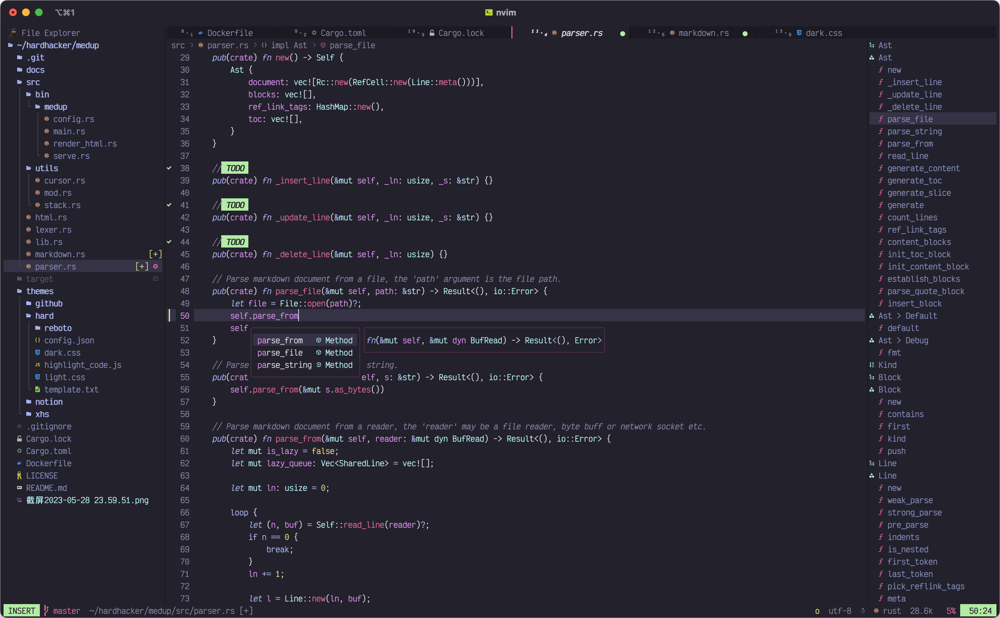
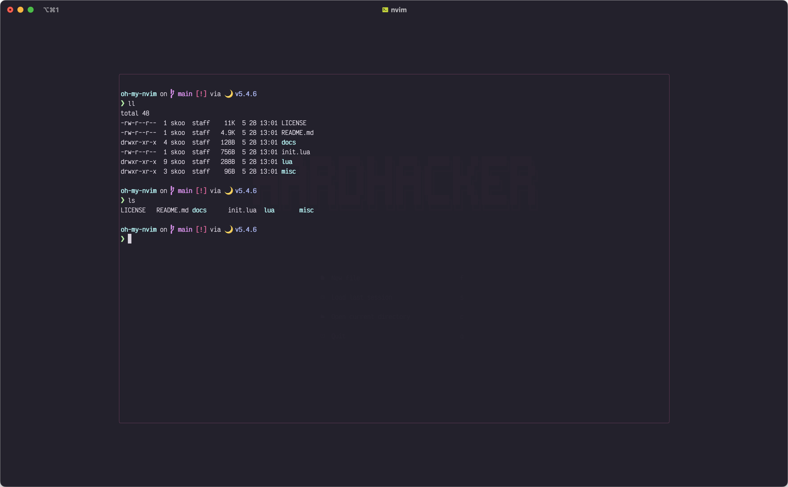

<p align="center">
  
</p>

<h1 align="center">
    oh-my-nvim<br/>
  <a href="https://discord.com/invite/MGmp9QjfkK">
    
  </a>
</h1>


**A consistent, pretty, modern neovim configuration with integrated cool and useful plugins 💎**

## 📦 Features

* Session load and switch
* File explorer
* File find and search
* Float terminal
* LSP
* Pretty code highlighting, Colors highlighting
* Auto completion
* Languages
* Git integration
* Git diff view
* Pretty Tab line, Status line
* Markdown Preview via your browser
* Starting screen
* Quick resize the window
* Customization of frequently used shortcuts
* ...

## 🎆 Preview






## 📸 Load and switch project

The video shows opening a project and then switching to another project.
Here the project is loaded and switched via nvim's session.
Thus, a project is a session.


When nvim is started in a directory, it is created as a session based on that directory, 
so we can always start nvim in the root directory of a project.

We can use the `F6` shortcut (by default) to select and switch a project(session).

## 📌 Requirements

* Neovim 0.8+
* Not required, but recommended
    * [nerd font](https://www.nerdfonts.com/font-downloads) 
        * Victor Mono Nerd Font
        * JetBrainsMono Nerd Font
        * ...
    * [ripgrep](https://github.com/BurntSushi/ripgrep) 
    * [fd](https://github.com/sharkdp/fd)

## 🚧 Install

### MacOS/Linux

#### 0️⃣  Backup your current nvim

```
mv ~/.config/nvim       ~/.config/nvim.bak
mv ~/.local/share/nvim  ~/.local/share/nvim.bak
```

#### 1️⃣  Clone oh-my-nvim repo

```
git clone https://github.com/hardhackerlabs/oh-my-nvim.git ~/.config/nvim
```

#### 2️⃣  Start `nvim` in your terminal, then automatically install and setup all plugins

#### 3️⃣  Restart `nvim` and enjoy it 🍻 

## 🧱 Languages

#### Install LSP Server

Use command `:LspInstall` to download and install a server, e.g. `:LspInstall rust_analyzer`.

#### Install TreeSitter Parser

Use command `:TSInstall` to download and install a parser, e.g. `:TSInstall rust`.

## ⌨️  Shortcut Keys

[👉 View the default shortcut settings](https://github.com/hardhackerlabs/oh-my-nvim/blob/main/lua/custom_keys.lua)

You can edit the default settings of the shortcut keys in this configuration file (`~/.config/nvim/lua/custom_keys.lua`).

## 💖 Recommendations for Neovim GUI

* [Neovide](https://neovide.dev/) (Developed by rust)

## 🏠 Add the plugins you want

If you want to add your own plugins, you can create a `my.lua` file in the directory `~/.config/nvim/lua/plugins`. Setup the plugins in this file.

The configuration of the plugins in the `my.lua` file can be found in the following template:

```
return {
    -- Your Plugin1
    {
        'hardhacker/plugin1',
        config = function() ... end
    },

    -- Your Plugin2
    {'hardhacker/plugin2'},
}
```

## 🧩 Plugins

* [lazy.nvim](https://github.com/folke/lazy.nvim) (Plugin manager)
* [hardhacker-theme](https://github.com/hardhackerlabs/theme-vim)
* [nvim-notify](https://github.com/rcarriga/nvim-notify)
* [nvim-web-devicons](https://github.com/nvim-tree/nvim-web-devicons)
* [dashboard-nvim](https://github.com/nvimdev/dashboard-nvim)
* [toggleterm.nvim](https://github.com/akinsho/toggleterm.nvim)
* [gitsigns.nvim](https://github.com/lewis6991/gitsigns.nvim)
* [diffview.nvim](https://github.com/sindrets/diffview.nvim)
* [lualine.nvim](https://github.com/nvim-lualine/lualine.nvim)
* [nvim-lspconfig](https://github.com/neovim/nvim-lspconfig)
* [nvim-cmp](https://github.com/hrsh7th/nvim-cmp)
* [cmp-nvim-lsp](https://github.com/hrsh7th/cmp-nvim-lsp)
* [cmp-buffer](https://github.com/hrsh7th/cmp-buffer)
* [cmp-path](https://github.com/hrsh7th/cmp-path)
* [cmp-cmdline](https://github.com/hrsh7th/cmp-cmdline)
* [lspkind.nvim](https://github.com/onsails/lspkind.nvim)
* [nvim-treesitter](https://github.com/nvim-treesitter/nvim-treesitter)
* [bufferline.nvim](https://github.com/akinsho/bufferline.nvim)
* [telescope.nvim](https://github.com/nvim-telescope/telescope.nvim)
* [neo-tree.lua](https://github.com/nvim-neo-tree/neo-tree.nvim)
* [markdown-preview.nvim](https://github.com/iamcco/markdown-preview.nvim)
* [nvim-colorizer.lua](https://github.com/norcalli/nvim-colorizer.lua)
* [smart-splits.nvim](https://github.com/mrjones2014/smart-splits.nvim)
* [bufdelete](https://github.com/famiu/bufdelete.nvim)
* [aerial](https://github.com/stevearc/aerial.nvim)
* [neovim-session-manager](https://github.com/Shatur/neovim-session-manager)

